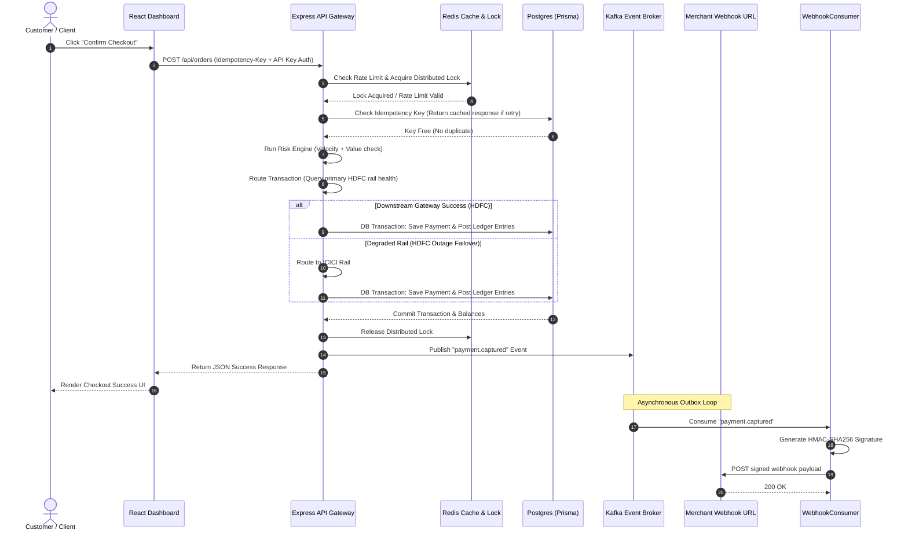
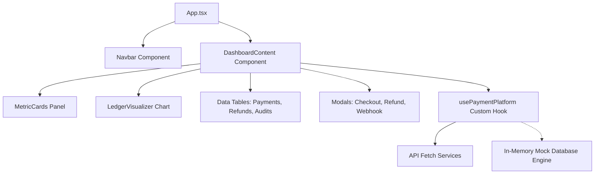
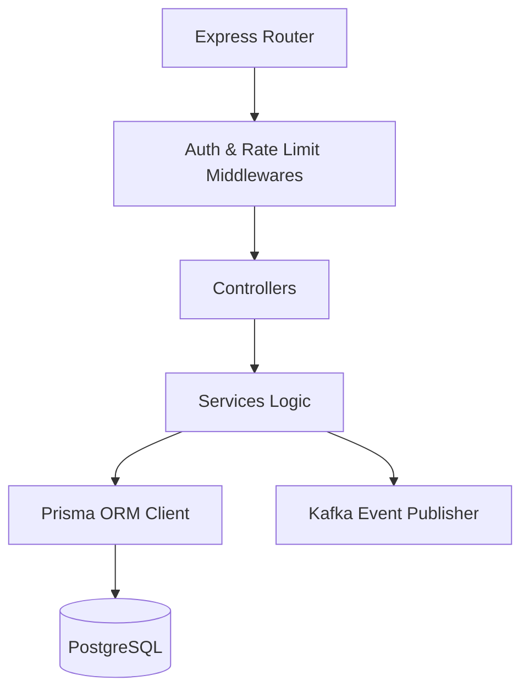
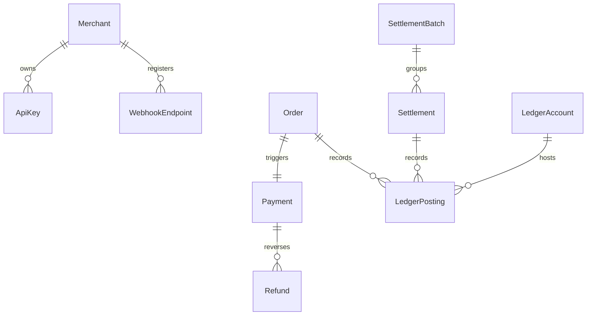
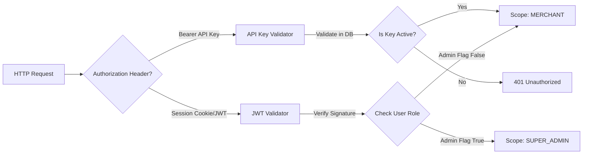
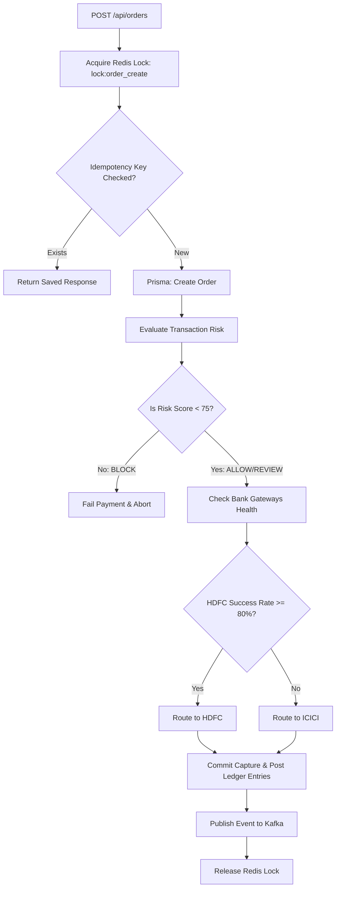
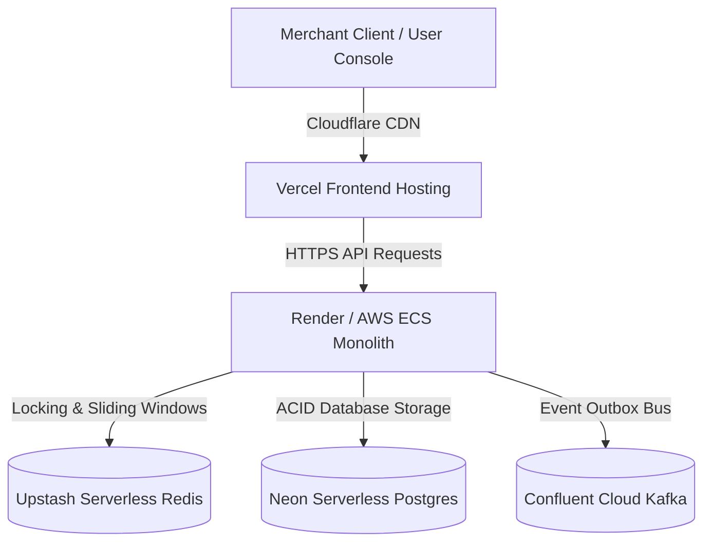
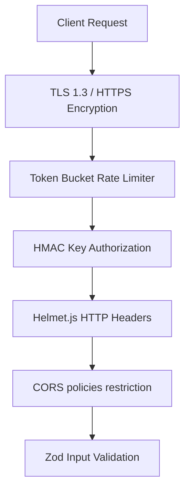
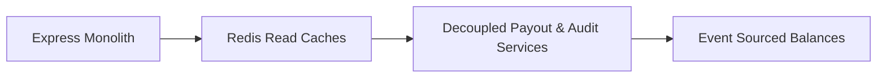

# PayNexus - Comprehensive Systems Architecture Guide

Welcome to the **PayNexus Architecture Guide**. This document outlines the end-to-end engineering architecture, data flows, ledger structures, risk engines, and failover topologies that power India's modern, high-throughput payment infrastructure platform.

This guide is designed to help engineers, technical leaders, product managers, and reviewers understand the entire platform within 5–10 minutes.

---

## 1. Project Overview

### Project Name
**PayNexus** (formerly StripeX)

### Problem Statement
Modern digital payment integration layers suffer from:
1. **Downstream Gateway Outages:** Downtime of major bank rails (e.g., HDFC, ICICI) causing immediate capture failures.
2. **Bookkeeping Discrepancies:** Simple database column mutability (e.g., `balance = balance + amount`) creating untraceable accounting errors.
3. **Double Capture Vulnerabilities:** Lack of strict idempotency keys leading to duplicate billing of clients during API timeouts.
4. **Fraud Vulnerabilities:** Absence of real-time multi-dimensional rate/velocity tracking.

### Why PayNexus Exists
PayNexus provides a secure, low-latency API gateway connecting merchants to payment networks. It introduces a multi-tier gatekeeping layer (token buckets, Redlock, and idempotency states), real-time sliding-window risk scoring, automatic failover routing, and a strict GAAP-compliant double-entry ledger database schema to ensure absolute financial reconciliation.

### Target Users
* **Enterprise Merchants:** Integrate checkout APIs to capture card, UPI, and Netbanking payments.
* **Payment Operations Teams:** Monitor gateway health, success rates, and manage bank payout settlements.
* **Risk & Compliance Officers:** Audit high-risk transactions, inspect fraud alert triggers, and verify immutable audit trails.

### Key Features
* **Multi-Tier Gatekeeping:** Atomic Redis Lua Token Bucket Rate Limiting & Asymmetric API Key validation.
* **Double-Entry Reconciliation:** Balance calculations built on transaction postings (debits matching credits).
* **Smart Bank Gateway Routing:** Real-time downstream success monitoring with automatic failover rails.
* **Risk Evaluation Engine:** Sliding-window IP/Merchant velocity monitors and transaction value guards.
* **Kafka-driven Outbox:** Asynchronous webhooks and system state change logging.
* **In-Memory Fallback Console:** Sleek glassmorphic web dashboard that runs entirely in-browser if the API is offline.

### Business Value
Eliminates transaction reconciliation gaps, keeps system availability high during bank disruptions, and completely protects systems against double-payment capture bugs.

---

## 2. System Architecture Overview

PayNexus uses a highly coordinated, event-driven monolith pattern. Below is the system-wide topology:

```mermaid
flowchart TD
    Client[Merchant Checkout / API Client] -->|1. HTTPS POST /api/orders| ExpressApp[Express Monolith Server]
    
    subgraph Gatekeeping & Lock Layer (Redis)
        ExpressApp -->|2. Check Key & Rate Limit| TokenBucket[Token Bucket Lua Script]
        TokenBucket -->|3. Check Key Presence| Idempotency[Idempotency Key Engine]
        Idempotency -->|4. Acquire Lock| RedisLock[Redis Distributed Lock]
    end
    
    subgraph Core Transaction Processing
        RedisLock -->|5. Evaluate Risk| FraudEngine[Fraud & Risk Engine]
        FraudEngine -->|6. Assign Route| RoutingService[Smart Gateway Router]
        RoutingService -->|7. Exec DB Transaction| DB[Prisma Client / PostgreSQL]
        DB -->|8. Ledger Journal Entry| LedgerService[Double-Entry Ledger]
    end
    
    subgraph Message Broker & Consumers
        LedgerService -->|9. Publish Event| Kafka[Kafka Event Broker]
        Kafka -->|Topic: payment.captured| AnalyticsConsumer[Analytics Consumer]
        Kafka -->|Topic: payment.captured| AuditConsumer[Audit Logs Consumer]
        Kafka -->|Topic: payment.captured| WebhookConsumer[Webhook Delivery Consumer]
    end
    
    subgraph Backend State Cache & Metrics
        AnalyticsConsumer -->|Update stats| RedisStats[Redis Cache Metrics]
        AuditConsumer -->|Write state logs| DB
        WebhookConsumer -->|Signed HTTP POST| MerchantWebhook[Merchant Server URL]
    end
    
    subgraph Real-Time Console Interface
        ReactDashboard[React Glassmorphic Dashboard] -->|Polls metrics| RedisStats
        ReactDashboard -->|Queries logs| ExpressApp
        ReactDashboard -.->|Offline Fallback| BrowserDB[Local Storage Database]
    end
```

### Component Explanations
* **Express Monolith Server:** Serves as the central API gateway. Handles routing, authentication, and HTTP request coordination.
* **Redis Cache & Lock:** Manages rate limits (token bucket Lua script), idempotency response caching, distributed locking (Redlock), and sliding-window velocities.
* **PostgreSQL (Prisma ORM):** Acts as the database system of record, storing immutable ledger entries, transaction histories, API keys, and audit states.
* **Kafka Event Broker:** Receives transaction status events and broadcasts them to decoupled consumer groups.
* **Event Consumers:** Asynchronously update dashboard metrics in Redis, post state audit trails to Postgres, and sign/dispatch merchant HTTP webhooks.
* **React Dashboard Console:** Glassmorphic console that visualizes payments, audits, and gateway statistics. Integrates an in-memory browser engine for zero-dependency demos.

---

## 3. Application Flow

The sequence diagram below traces a merchant's payment capture request from initiation to database commit and asynchronous webhook execution:



### Step-by-Step Explanation
1. **Checkout Action:** The customer submits a card payment. The frontend triggers an authenticated API request to `/api/orders`.
2. **Gatekeeping:** The gateway validates the API key, checks token-bucket limits, and claims a distributed lock in Redis for the transaction.
3. **Idempotency Guard:** The system searches PostgreSQL to ensure the `Idempotency-Key` hasn't already been processed.
4. **Risk & Routing:** The Fraud Engine generates a risk score. The Smart Router determines if the primary rail (HDFC) is operational (success rate $\ge 80\%$) and routes it, automatically falling back to ICICI if degraded.
5. **Atomic DB Commit:** Prisma opens an isolated database transaction, saves the payment, and posts corresponding double-entry ledger rows.
6. **Kafka Pub/Sub:** The Express app releases the Redis lock, publishes a `payment.captured` event to Kafka, and replies to the client.
7. **Signed Outbound Webhook:** The Webhook consumer signs the payload using the merchant's signature secret and POSTs it to the merchant server.

---

## 4. Frontend Architecture

The PayNexus dashboard is built using a modern decoupled React frontend designed for live data visualization:



### Layer Responsibilities
* **App Shell Layout (`App.tsx` & `Navbar`):** Coordinates page navigation tabs, active merchant roles, and indicates whether the local browser is connected to the backend API.
* **Custom State Hook (`usePaymentPlatform`):** Encapsulates all dashboard state. Consolidates database fetches, handles order creation, initiates refund rollbacks, and hosts the simulated database fallback.
* **Component Layer (`MetricCards`, `LedgerVisualizer`):** Sub-components displaying key stats (Total Volume, Reserves, Fees) and drawing animated balance sheet charts via Recharts.
* **API / Mock Engine (`API`, `Fallback`):** Integrates standard REST endpoints. If the backend server is offline, it activates the fallback engine to mock state changes inside LocalStorage.

---

## 5. Backend Architecture

The backend monolith is structured into domain-specific modules with strict layering:



### Module Responsibilities
* **Middleware Layer:** Authorizes API keys (matching prefix keys to merchant scopes), restricts client requests, and handles CORS/security headers.
* **Controllers:** Extract request payloads, check required parameter schemas, and format unified HTTP JSON responses.
* **Services Layer:** Contains business rules. Houses double-entry ledger math, gateway health evaluations, routing failover logic, and fraud scoring.
* **Prisma Persistence:** Executes queries against PostgreSQL. Guarantees ACID compliance by locking records inside transaction blocks.

---

## 6. Database Design

PayNexus implements a relational schema on PostgreSQL designed for financial auditability:



### Table Schema Definitions

#### 1. LedgerAccount
* **Purpose:** Stores the names and normal balance configurations of individual accounting ledgers.
* **Key Fields:** `id`, `name`, `type` (`DEBIT_NORMAL` vs `CREDIT_NORMAL`), `merchantId`.
* **Relationships:** Hosts multiple ledger postings.

#### 2. LedgerPosting
* **Purpose:** Immutable journal ledger ledger postings recording debit/credit transfers.
* **Key Fields:** `id`, `accountId`, `amount` (BigInt in cents), `type` (`DEBIT` or `CREDIT`), `orderId`, `settlementId`.
* **Relationships:** Links back to `LedgerAccount`, optional references to `Order` or `Settlement`.

#### 3. Order
* **Purpose:** Tracks client transaction requests and statuses.
* **Key Fields:** `id`, `merchantId`, `amount` (BigInt), `currency`, `status` (`CREATED`, `AUTHORIZED`, `CAPTURED`, `FAILED`, `REFUNDED`, `SETTLED`).
* **Relationships:** Has one `Payment` and links to matching `LedgerPosting` rows.

#### 4. Payment
* **Purpose:** Logs bank transaction capture responses.
* **Key Fields:** `id`, `orderId`, `status`, `gateway` (`HDFC`, `ICICI`), `riskScore`, `riskStatus` (`ALLOW`, `REVIEW`, `BLOCK`).

#### 5. Settlement
* **Purpose:** Logs funds moved from merchant pending balance to settled cash.
* **Key Fields:** `id`, `batchId`, `grossAmount`, `payoutReference`, `status` (`INITIATED`, `SUCCEEDED`, `FAILED`).

---

## 7. Authentication & Authorization

Access control separates merchant checkout integrations from administrative commands:



### User Roles
* **MERCHANT (API Clients & Developers):** Allowed to capture checkouts (`POST /api/orders`), issue partial refunds (`POST /api/refunds`), and read their own metrics.
* **SUPER_ADMIN (Operations & Risk Managers):** Permitted to run cron settlement sweeps (`POST /api/settlements/batch`), view risk queues, and audit system-wide logs.

---

## 8. Feature Architecture

Here are the workflows for the core modules:

### 8.1 Payment Capture & Smart Failover Workflow



---

## 9. API Architecture

| Endpoint | Method | Role | Purpose |
| :--- | :--- | :--- | :--- |
| **Auth APIs** | | | |
| `/api/keys` | `POST` | `MERCHANT` | Generates a new cryptographically signed API Key |
| `/api/keys/:id` | `DELETE` | `MERCHANT` | Revokes an active API Key |
| **Order/Payment APIs** | | | |
| `/api/orders` | `POST` | `MERCHANT` | Creates a payment order (Idempotency required) |
| `/api/orders` | `GET` | `MERCHANT` | Fetches payment histories and ledger statuses |
| `/api/refunds` | `POST` | `MERCHANT` | Triggers a partial/full ledger reversal |
| **Settlement APIs** | | | |
| `/api/settlements/batch`| `POST` | `SUPER_ADMIN`| Triggers a T+1 cron settlement batch payout |
| `/api/settlements` | `GET` | `MERCHANT` | Queries payout settlement run logs |
| **Admin & Compliance** | | | |
| `/api/admin/audit-logs` | `GET` | `SUPER_ADMIN`| Fetches immutable system-wide activity audit trails|
| `/api/admin/risk-alerts`| `GET` | `SUPER_ADMIN`| Queries active risk reviews flagged by engine |

---

## 10. Folder Structure

Below is the directory map of the PayNexus workspace:

```text
payment-platform-root/
│
├── .github/
│   └── workflows/
│       └── ci.yml               # CI/CD GitHub Actions Pipeline
│
├── apps/
│   ├── backend/                 # Express REST API Monolith
│   │   ├── prisma/
│   │   │   └── schema.prisma    # Database Schema Source of Truth
│   │   └── src/
│   │       ├── modules/         # Domain Modular Subsystems
│   │       │   ├── audit/       # Audit trail logger
│   │       │   ├── fraud/       # Sliding-window risk engine
│   │       │   ├── ledger/      # Double-entry ledger books
│   │       │   ├── payment/     # Checkouts & captures coordinator
│   │       │   └── settlement/  # T+1 Payout settlement batcher
│   │       └── shared/          # Shared database, Redis, and Kafka modules
│   │
│   └── dashboard/               # Vite React Console Dashboard
│       ├── src/
│       │   ├── components/      # UI Panels (Visualizers, Tables, Cards)
│       │   ├── hooks/           # usePaymentPlatform (State & Offline Mock)
│       │   └── App.tsx          # Main entry and UI routing
│
├── architecture.md              # Systems architecture guide
├── README.md                    # Project setup instructions
└── docker-compose.yml           # Database, Redis, and Kafka dev servers
```

---

## 11. Data Flow Diagram

```mermaid
flowchart LR
    User[Client Browser] -->|1. Submit Checkout| Gateway[Express API Gateway]
    Gateway -->|2. Check Limit| Redis[Redis Token Bucket]
    Redis -->|3. Evaluate Risk| Fraud[Risk Engine]
    Fraud -->|4. Smart Route| Bank[Bank Nodal Rail]
    Bank -->|5. Commit DB Transaction| Postgres[(PostgreSQL Database)]
    Postgres -->|6. Record Journal Ledger| Ledger[Double-Entry Ledger]
    Ledger -->|7. Publish Event| Kafka[Kafka Event Bus]
    Kafka -->|8. Webhook Outbox| Merchant[Merchant Webhook URL]
```



### Flow Step Description
1. **Submit Checkout:** Customer sends checkout information.
2. **Check Limit:** Rate limit checked on Redis via Lua script.
3. **Evaluate Risk:** Fraud engine evaluates IP velocity and transaction amount.
4. **Smart Route:** Payment routing selects operational bank rail (primary HDFC / secondary ICICI).
5. **Commit DB:** Prisma commits the payment capture.
6. **Journal Ledger:** Immutable double-entry ledger records are posted (assets matching liabilities).
7. **Publish Event:** Event emitted to Kafka broker.
8. **Webhook Outbox:** Kafka consumer pushes a signed HMAC-SHA256 payload to the merchant.

---

## 12. Deployment Architecture



### Hosting Environments
* **Vercel:** Hosts the Vite React frontend. Speeds up loading times worldwide using Cloudflare edge caches.
* **Render / AWS ECS:** Runs the Express backend app. Monitored with auto-scaling groups to manage high volume periods.
* **Neon Serverless Postgres:** Serves as the relational database. Runs automatic migrations, database backups, and supports instant scale-up computing.
* **Upstash Serverless Redis:** Provides low-latency key stores for rate limits and distributed locking.
* **Confluent Cloud:** Managed Kafka platform coordinating outbox event streaming.

---

## 13. Security Architecture

PayNexus enforces security best practices across every system layer:



### Security Measures
* **HMAC Asymmetric Signing:** Inbound developer requests require secret header signatures; outbound webhook payloads are signed using HMAC-SHA256.
* **Rate-Limit Protections:** Limits API flooding using token buckets.
* **Strict Input Validation:** Express endpoints use strict schemas to filter out SQL/NoSQL injections.
* **Isolated Environment Settings:** Production configurations (database credentials, signing keys) are injected at runtime via environment variables.

---

## 14. Scalability Considerations

1. **Database Partitioning & Read Replicas:** Ledger tables are query-heavy. Scaling involves routing read balances to PostgreSQL read replicas while routing write ledger postings to the master node.
2. **Distributed Redis Locks:** Distributed locking (Redlock) prevents transaction collisions on duplicate captured orders across multiple server instances.
3. **Kafka Event Decoupling:** Decoupling webhooks, email alerts, and compliance log indexing to separate Kafka consumer microservices ensures API Gateway thread loops remain unblocked.

---

## 15. Architecture Decisions (ADR)

| Decision | Reason | Tradeoffs |
| :--- | :--- | :--- |
| **React (Vite)** | Superfast DOM rendering, quick local development, and seamless state hook fallbacks. | Requires client-side JS execution. |
| **PostgreSQL** | ACID-compliant transactional blocks, foreign-key relationships, and high query performance. | Harder to scale horizontally compared to NoSQL. |
| **Express.js** | Lightweight, event-driven request loop, and rich middleware support. | Developer is responsible for project file structure. |
| **Double-Entry Ledger**| Guarantees mathematical equality of balances; provides auditor verification logs. | Multiplies database write volumes. |

---

## 16. Future Architecture Roadmap



* **Redis Read Caching:** Cache resolved ledger balances in Redis to avoid executing heavy Postgres sum queries on every dashboard load.
* **Decoupled Payout Services:** Move settlement batch crons to isolated lambda jobs or background workers to prevent database load spikes on the main API server.
* **Event Sourcing:** Implement event sourcing patterns using Kafka event streams to recreate account balances at any point in time.

---

## 17. Quick Start For New Developers

### Prerequisites
* Node.js v18+
* Docker Desktop (for running Postgres, Redis, and Kafka)

### Local Configuration Steps

1. **Clone & Install Packages:**
   ```bash
   git clone https://github.com/Prudhvi-2412/PayNexus.git
   cd PayNexus
   npm install
   ```

2. **Start Infrastructure Services:**
   ```bash
   docker-compose up -d
   ```

3. **Backend Database Migrations:**
   ```bash
   cd apps/backend
   npx prisma db push
   ```

4. **Launch Local Servers:**
   * Run Backend: `cd apps/backend && npm run dev`
   * Run Dashboard: `cd apps/dashboard && npm run dev`

---

## 18. Architecture Summary (2-Minute Overview)

PayNexus operates as a dual-account ledger payment gatekeeper:

1. **The Ingest Phase:** A merchant requests payment capture via `/api/orders`. The system validates the request through API key layers, rate limiters, and idempotency checks.
2. **The Processing Phase:** The Fraud Engine checks IP and merchant velocities. The Smart Router selects the healthiest bank rail (HDFC/ICICI) and executes the capture.
3. **The Bookkeeping Phase:** In a single ACID transaction, PostgreSQL records the capture and writes matching debit/credit ledger postings (representing cash assets versus merchant liabilities).
4. **The Broadcast Phase:** The system emits a status event to Kafka. Decoupled consumers process this event to update dashboard graphs, write audit logs, and dispatch signed outbound webhooks.

This workflow guarantees payment system availability, auditability, and protection against transaction errors.
