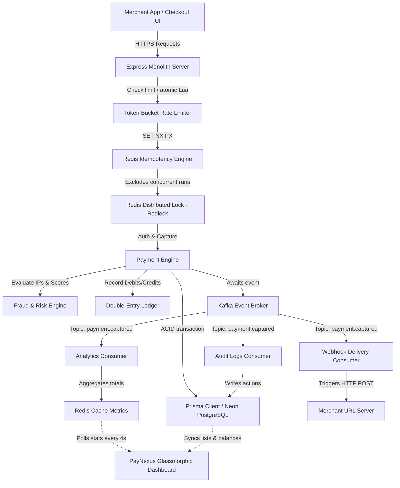
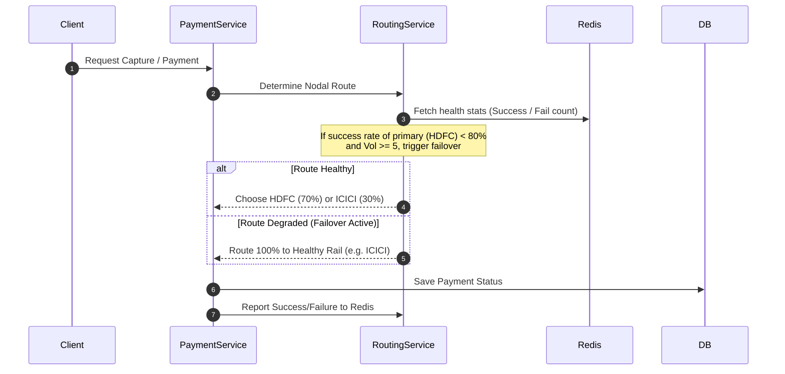
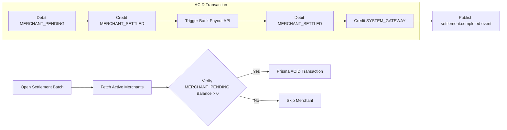

# PayNexus - End-to-End System Architecture

PayNexus is a high-throughput, premium payment infrastructure platform designed to handle transactional ingestion, risk-checking, double-entry ledger reconciliation, and merchant settlements.

---

## 1. High-Level Architecture Diagram

The diagram below maps the complete lifecycle of a client request, through the API gateways, caching, distributed locks, database persistence, and asynchronous message broker loops:

---

## 2. Core Subsystems & Workflows

### 2.1 API Protection & Performance (Redis Layer)
To protect downstream database connections and external banking channels, every mutative action goes through three layers of defense inside Redis:
1. **Token Bucket Rate Limiter (Lua Script)**: Atomically checks and decrements available tokens per key inside Redis using a script to ensure high performance and prevent race conditions.
2. **Sub-Millisecond Idempotency Middleware**: Checks if a unique `idempotency-key` is already `IN_PROGRESS` or `COMPLETED` in Redis. On completion, the HTTP response status and body are cached for **24 hours**, resolving duplicate requests instantly without hit overhead on PostgreSQL.
3. **Distributed Locks (Redlock Primitives)**: Guards operations like captured transactions, refunds, and batch runs using atomic `SET NX PX` locks. Released via a Lua script that verifies lock ownership to avoid lock collisions.

---

### 2.2 Smart Routing & Gateway Failover Engine
Dynamic Routing ensures transactions auto-failover during bank degradation without merchant intervention:

* **Simulating Outages**: If a transaction capture amount ends in `5` (e.g., ₹105, ₹125) and HDFC is active, the route reports a mock bank rail failure. After 5 failures, HDFC is automatically flagged as `DEGRADED`, and the Smart Router steers 100% of new traffic to ICICI.

---

### 2.3 Double-Entry General Ledger System
To guarantee financial integrity, balances are not stored in simple database columns. Instead, they are dynamically aggregated from ledger entry records using a strict accounting equation:

$$\text{Sum(Debits)} = \text{Sum(Credits)}$$

#### Capture Accounting Postings:
* **Debit**: `SYSTEM_GATEWAY` (Gateway Receivable account) -> Full Amount
* **Credit**: `Merchant Account` (Merchant Pending balance) -> Net Amount (Gross - Fees)
* **Credit**: `SYSTEM_PLATFORM` (Platform Revenue account) -> Platform fee (2% + flat ₹30)

#### Refund Reversal Postings:
* **Debit**: `Merchant Account` (Merchant Pending balance) -> Pro-rated Net Reversal
* **Debit**: `SYSTEM_PLATFORM` (Platform Revenue account) -> Pro-rated Fee Reversal
* **Credit**: `SYSTEM_GATEWAY` (Gateway Receivable account) -> Refund Gross Payout

---

### 2.4 T+1 Settlement Engine
The settlement process runs bulk transfers to clear funds from merchant ledger wallets to external bank rails:

---

### 2.5 Webhooks Delivery & Audit Loops
1. **Asynchronous Processing**: Express saves transaction status changes and publishes events (e.g., `payment.captured`) to Kafka topics, decoupling HTTP response speeds from slow webhook deliveries.
2. **Backoff Retries**: If the merchant's endpoint is unreachable or returns a non-2xx response, the delivery retry loop reschedules the event with an exponential backoff time (Interval $\times 2^{\text{Retry Count}}$) up to 5 times.
3. **Audit Trails**: The Audit consumer consumes events from Kafka and writes raw action histories directly to the database for administrative trace verification.

---

## 3. Real-Time Dashboard Integration
The React client hooks into PayNexus's backend using polling intervals to display real-time updates:
* **Operations heartbeats** check the status of HDFC and ICICI routing rails, highlighting degraded states and failovers.
* **Balances and journal list tables** sync directly from the backend's ledger endpoints, offering a single source of truth across payment logs, ledger entries, settlements, and audit trails.
