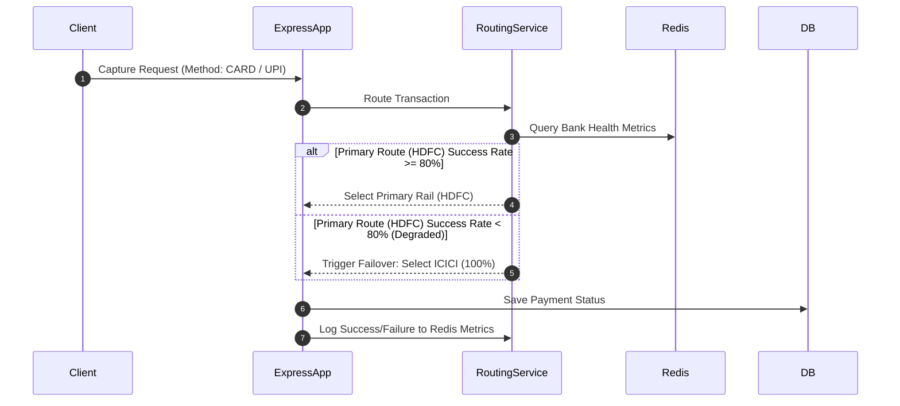
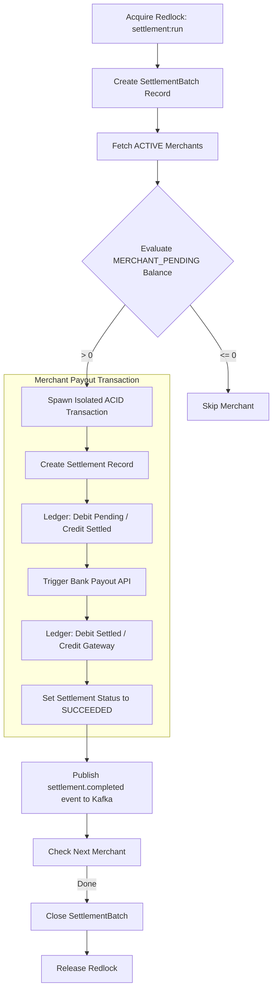

# PayNexus - End-to-End Systems Architecture Guide

PayNexus is a high-throughput, enterprise-grade payment infrastructure platform designed for low-latency transaction ingestion, risk detection, double-entry ledger bookkeeping, and automated merchant settlements. The architecture prioritizes ACID transactional integrity, multi-tier API gatekeeping, and graceful failover routes during bank partner degradation.

---

## 1. High-Level System Architecture

The following diagram traces a client request through the API gateway layers, token-bucket limits, distributed locks, risk validation, database persistence, transaction ledger posting, and asynchronous Kafka event consumers:

```mermaid
flowchart TD
    Client[Merchant Checkout / API Client] -->|HTTPS POST /api/v1/payments| ExpressApp[Express Monolith Server]
    
    %% Redis Security Gates
    subgraph API Gatekeeping (Redis)
        ExpressApp -->|1. Validate Key / Rate Limit| TokenBucket[Token Bucket Lua Script]
        TokenBucket -->|2. Check Key Presence| Idempotency[Postgres & Redis Idempotency Engine]
        Idempotency -->|3. Acquire Lock| RedisLock[Redis Distributed Lock - Redlock]
    end
    
    %% Transaction Processing
    subgraph Processing Core
        RedisLock -->|4. Risk Evaluation| FraudEngine[Fraud & Risk Engine]
        FraudEngine -->|5. Smart Route| RoutingService[Smart Gateway Router]
        RoutingService -->|6. Execute DB Transaction| DB[Prisma Client / PostgreSQL]
        DB -->|7. Post Entries| LedgerService[Double-Entry Ledger]
    end
    
    %% Event Loop
    LedgerService -->|8. Publish Event| Kafka[Kafka Event Broker]
    
    %% Consumers
    subgraph Event Consumers
        Kafka -->|Topic: payment.captured| AnalyticsConsumer[Analytics Consumer]
        Kafka -->|Topic: payment.captured| AuditConsumer[Audit Logs Consumer]
        Kafka -->|Topic: payment.captured| WebhookConsumer[Webhook Delivery Consumer]
    end
    
    %% Final Actions
    AnalyticsConsumer -->|Update stats| RedisStats[Redis Cache Metrics]
    AuditConsumer -->|Write state logs| DB
    WebhookConsumer -->|Signed HTTP POST| MerchantWebhook[Merchant Server URL]
    
    %% Dashboard
    RedisStats -.->|Real-time Polls| ReactDashboard[PayNexus Glassmorphic Dashboard]
    DB -.->|Sync Ledger Balances| ReactDashboard
```

---

## 2. Deep-Dive Subsystem Workflows

### 2.1 Multi-Tier API Gatekeeping (Redis & Postgres)
Before any transaction hits the database, PayNexus enforces three successive lines of defense:
1. **Token Bucket Rate Limiter (Redis Lua Script)**: Restricts client requests per API Key. Executed as an atomic Lua script inside Redis to prevent race conditions and ensure sub-millisecond processing times.
2. **Double-Ended Idempotency Engine**: Checks the `Idempotency-Key` header. In-flight requests are marked as `IN_PROGRESS` in Redis. On completion, the HTTP response status code and response body are written to PostgreSQL (`idempotency_keys` table) and cached in Redis for **24 hours**. Retries within this window receive the cached response instantly, avoiding redundant DB transactions or double capture requests.
3. **Distributed Locking (Redlock)**: Guard rails like global settlement batches are protected via Redis locks to prevent concurrent executions in load-balanced environments.

---

### 2.2 Smart Routing & Automatic Bank Failover
The gateway routing layer monitors downstream bank health (e.g., HDFC and ICICI) and dynamically reroutes traffic to maximize successful capture rates:



> [!NOTE]
> **Outage Simulation**: If a transaction capture amount ends in a `5` digit (e.g., $105.05, $15.55) and is routed to HDFC, the routing service simulates a mock bank connection failure. After 5 consecutive failures, the HDFC success rate falls below 80%, triggering an automatic failover that routes 100% of new traffic to ICICI.

---

### 2.3 GAAP-Compliant Double-Entry Ledger
To eliminate financial discrepancies, PayNexus does not store balances in standard columns. Instead, all account balances are dynamically computed from transactional entries using the core accounting equation:

$$\text{Sum(Debits)} = \text{Sum(Credits)}$$

Ledger entries are classified by account type normals:
* **Credit-Normal Accounts** (Balance = Credits - Debits): MERCHANT_PENDING, MERCHANT_AVAILABLE, MERCHANT_SETTLED, PLATFORM_REVENUE.
* **Debit-Normal Accounts** (Balance = Debits - Credits): GATEWAY_RECEIVABLE, CUSTOMER_WALLET.

#### Journal Entry Configurations:

| Transaction Event | Ledger Account Affected | Entry Type | Description |
| :--- | :--- | :--- | :--- |
| **Payment Capture** | `SYSTEM_GATEWAY` (Gateway Receivable) | **DEBIT** | Full transaction gross amount |
| | `Merchant ID` (Merchant Pending) | **CREDIT** | Transaction net amount (Gross - Fees) |
| | `SYSTEM_PLATFORM` (Platform Revenue) | **CREDIT** | Platform fee (2% + $0.30 flat) |
| **Settlement Step 1** | `Merchant ID` (Merchant Pending) | **DEBIT** | Clears pending merchant balance |
| | `Merchant ID` (Merchant Settled) | **CREDIT** | Locks funds into settlement status |
| **Settlement Step 2** | `Merchant ID` (Merchant Settled) | **DEBIT** | Clears settled balance on bank payout |
| | `SYSTEM_GATEWAY` (Gateway Receivable) | **CREDIT** | Reduces cash asset as funds leave system |

---

### 2.4 T+1 Batch Settlement Engine
The settlement engine runs as an automated cron or manual administrative sweep to trigger bank transfers:



---

## 3. Fraud & Risk Engine
Every transaction undergoes automated scoring inside the risk module:
- **Rule 1 (High Value)**: Transactions $\ge \$10,000$ add **+45** to the risk score (`HIGH_VALUE_TRANSACTION`).
- **Rule 2 (IP Velocity)**: Evaluates requests from a single IP over a rolling 1-hour window using Redis sliding windows. Exceeding velocity limits adds **+40** (`IP_VELOCITY_EXCEEDED`); high-frequency traffic adds **+15** (`IP_VELOCITY_HIGH`).
- **Rule 3 (Merchant Velocity)**: Checks for payment bursts (>10 transactions per minute) per merchant ID using Redis, adding **+25** if exceeded (`MERCHANT_VELOCITY_EXCEEDED`).

### Risk Decisions:
- **Score $\ge$ 75 (BLOCK)**: Instantly aborts the database transaction and fails the payment, throwing a security exception.
- **Score $\ge$ 40 (REVIEW)**: Allows the transaction but logs a `RiskAlert` in the database, flagging the transaction for administrator manual review.
- **Score $<$ 40 (ALLOW)**: Approves transaction risk checks and forwards to bank gateway.

---

## 4. Webhook Deliveries & Audit Loops
1. **Outbox Event Flow**: Decoupled consumer groups subscribe to Kafka topics (`payment.captured`, `refund.completed`, etc.).
2. **Webhook Consumer**: Computes an HMAC-SHA256 signature using the merchant's secret key and posts the event payload to the registered webhook URL. If the server is offline or returns a non-2xx status, a retry loop reschedules the post using exponential backoff ($Interval \times 2^{\text{Retry Count}}$) up to 5 times.
3. **Audit Consumer**: Logs state changes (`beforeState` and `afterState`) to the `audit_logs` table, maintaining a non-repudiation log of admin and merchant actions.

---

## 5. Glassmorphic Console & In-Memory Fallback
The React dashboard console provides merchant and administrator views:
- **Live Heartbeats**: Polls Express `/health` endpoints and Redis metrics to report bank gateway states, transactions, and live settlement runs.
- **In-Memory Fallback Engine**: If the backend API server is offline or inaccessible, the console automatically switches to a self-contained in-memory fallback using local storage. This simulates ledger entries, checkout actions, database states, and settlement runs entirely in-browser for zero-dependency demonstrations.
